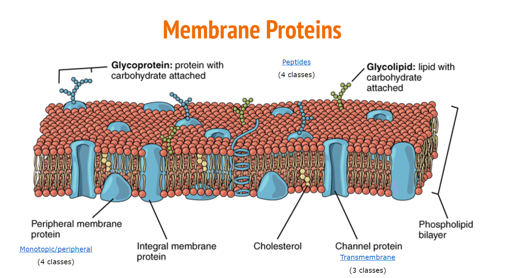

# OPMxplore-Tools to explore Orientiation of Membrane Protein Dataset

**Membrane proteins** are of three types: **Transmembrane**, **Monotopic** and **Small Peptides**. Membrane proteins have interesting structures and funtions.

The [**RCSB Protein Data Bank (PDB)**](https://www.rcsb.org/pdb/home/home.do) archives experimentally derived atomic coordinates and 3-dimensional structures of proteins.

The[**Orientation of Membrane Protein (OPM)** database](http://opm.phar.umich.edu/about.php) is maintained by researchers from University of Michigan. They obtain the information of membrane proteins from PDB and compute the spatial arrangement of protein structures in the lipid bilayer. The OPM database has interesting features of membrane proteins such as **Localization of the membrane**, **Depth**, **Tilt angle**, and **Gibbs free energy** (how likely will the protein go into the membrane from solution).

The OPM website has valuable information but here is no way to search the OPM dataset using custom query or visualize the relationship between proteins and their features. 

#**Project Description**

This Python module was built for a quick and interactive exploration of the [OPM website](http://opm.phar.umich.edu/about.php). 
The tools in this module will help to custom query membrane proteins and visualize relationships between proteins and their features. 

## **Getting Started**

### **Quick Start**

- Clone the github repo: [https://github.com/UWSEDS-aut17/OPMxplore.git)
- From the command line, navigate to the repo and run these commands to install all the requirements:
  - `pip install -r requirements.txt`
-Enable widgets for visualization
  - `pip install ipywidgets
     jupyter nbextension enable --py widgetsnbextension`
- Open Jupyter Notebook and open opm_demo.ipynb
 

### **Data**

* [RCSB Protein Data Bank (PDB)](https://www.rcsb.org/pdb/home/home.do)- use PyPDB to query.
* [OPM MySQL dataset](http://opm.phar.umich.edu/OPM-2016-10-10.sql)- download mySQL file.

### **Visualization Demo**

**Authors** : David Alan Starkebaum, Sinduja Karl Marx and Felcy Selwyn. 

